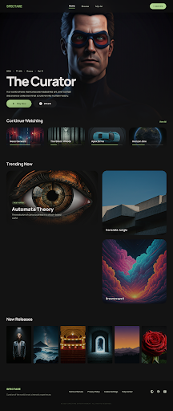
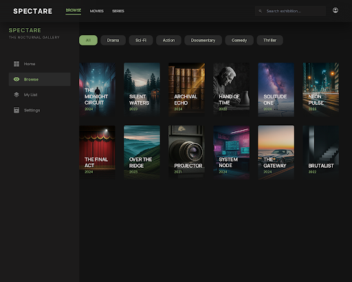
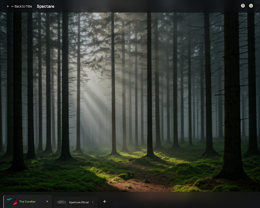
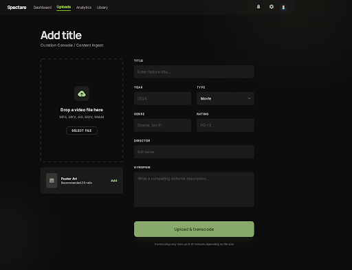

# Spectare

A premium VOD streaming platform — part of a video suite alongside [sub-one](https://github.com/Zuful/sub-one) and [captura](https://github.com/Zuful/captura).

Dark, cinematic UI inspired by Netflix/Disney+/Prime Video, built around a matcha green design system ("Spectare Cinematic"). Signature feature: multi-tab video player — watch multiple titles simultaneously and switch between them like browser tabs.

## Screenshots

| Home | Browse |
|------|--------|
|  |  |

| Player (multi-tab) | Upload |
|--------------------|--------|
|  |  |

## Requirements

- **Go** 1.19+
- **Node.js** 18+ and **npm**
- **ffmpeg** + **ffprobe** (for HLS transcoding and preview generation)

## Build

```bash
make build
```

Compiles the Next.js frontend to a static export and embeds it into a single Go binary. Must be run before `./spectare` — the frontend is not served until it has been built.

Without make:

```bash
cd frontend && npm install && npm run build && cd ..
go build -o spectare .
```

## Run

```bash
./spectare
# or with a custom port, data directory, and media source:
PORT=9000 DATA_DIR=/var/spectare MEDIA_DIR=/Volumes/MyDrive/Movies ./spectare
```

Opens at `http://localhost:8766`.

| Variable | Default | Description |
|----------|---------|-------------|
| `PORT` | `8766` | HTTP listen port |
| `DATA_DIR` | `./data` | Where metadata, thumbnails, HLS segments and the database are stored |
| `MEDIA_DIR` | *(unset)* | Folder to scan for videos on startup (supports removable media) |

If `MEDIA_DIR` is set, Spectare scans it at boot and registers all video files — no upload needed. You can rescan at any time via `POST /api/scan`. Videos on external drives are served directly; if the drive is disconnected, the stream returns 404 until reconnected.

The scanner also detects **companion files** placed alongside each video and imports them automatically:

| File | Imported as |
|------|-------------|
| `poster.jpg/png/webp` | Poster thumbnail (2:3) |
| `backdrop.jpg/png/webp` | Backdrop thumbnail (wide) |
| `cover.jpg` / `thumb.jpg` / `{videoname}.jpg` | Card thumbnail (16:9) |
| `en.srt`, `fr.srt`, … | Subtitles by language code |
| `{videoname}.en.srt`, `{videoname}.fr.vtt`, … | Subtitles (alternate naming) |

Companion files are copied into `DATA_DIR` at scan time, so they remain accessible even if the source drive is later disconnected.

## Development

```bash
# Terminal 1 — Go API server
make dev-backend

# Terminal 2 — Next.js with hot reload
make dev-frontend
```

The Next.js dev server proxies `/api` to `localhost:8766`.

## Stack

| Layer | Tech |
|-------|------|
| Frontend | Next.js 16 + Tailwind CSS v4 |
| Player | HLS.js (adaptive streaming) |
| Multi-tab state | Zustand |
| Backend | Go + chi |
| Database | bbolt (pure Go embedded key-value store) |
| Transcoding | ffmpeg → HLS segments (360p + 720p) |
| Preview generation | ffmpeg → 30s MP4 clip (auto on upload) |
| Storage | Local filesystem |
| Mobile | React Native / Expo *(coming soon)* |

## Workflow

### Option A — Upload via browser

1. Go to `/admin/upload`
2. Drop a video file (MP4, MKV, AVI, MOV, WebM — up to 8 GB)
3. Fill in metadata (title, year, genre tags, rating, synopsis, director)
4. Optionally upload visuals: **Card** (16:9), **Poster** (2:3), **Backdrop** (wide)
5. Click **Upload** — the file is immediately watchable via direct streaming
6. A 30-second preview clip is generated automatically in the background via ffmpeg
7. Optionally enable **Transcode to HLS** — ffmpeg generates 360p + 720p adaptive renditions
8. Edit metadata at any time via the **Edit** button on the title page

### Option B — Point at a folder

```bash
MEDIA_DIR=/path/to/videos ./spectare
```

All video files are scanned on startup. Titles and years are parsed from filenames (e.g. `Blade.Runner.2049.mkv` → *Blade Runner*, 2049). Videos are playable immediately; trigger HLS transcoding per-title from the title page.

## Browse features

- **Layout toggle** — landscape (16:9) or portrait (2:3) card grid
- **Hover preview** — hover a card for 1.5 s to expand it and autoplay the 30 s preview clip
- **Genre filters** — chips generated dynamically from actual genres in the library
- **Type filter** — Movies / Series
- **Search** — across title, director and genres

## Data layout

```
data/
  spectare.db          ← bbolt database (title metadata)
  titles/
    {id}/
      thumbnails/
        card.{ext}     ← 16:9 — shown in Browse grid
        poster.{ext}   ← 2:3  — shown on title detail page
        backdrop.{ext} ← wide — hero background on title page
      subtitles/
        en.srt         ← subtitle tracks by language code
        fr.vtt         ← .srt or .vtt
      preview.mp4      ← 30s preview clip (auto-generated or manual)
      original/
        video.*        ← source file (uploaded titles only)
      hls/             ← present after HLS transcoding
        master.m3u8
        360p/  …
        720p/  …
```

Titles sourced via `MEDIA_DIR` have no `original/` folder — the source file stays on the original drive.

## Routes

| Page | Path |
|------|------|
| Home | `/` |
| Browse / Catalogue | `/browse` |
| My List | `/my-list` |
| Title detail | `/title/[id]` |
| Player | `/watch/[id]` |
| Upload | `/admin/upload` |
| Edit title | `/admin/titles/[id]/edit` |

## API

| Method | Path | Description |
|--------|------|-------------|
| `GET` | `/api/titles` | List all titles |
| `POST` | `/api/titles` | Upload video + metadata (multipart/form-data) |
| `GET` | `/api/titles/{id}` | Get title metadata |
| `PUT` | `/api/titles/{id}` | Update metadata and/or thumbnails |
| `GET` | `/api/titles/{id}/status` | Transcoding progress `{status, progress}` |
| `POST` | `/api/titles/{id}/transcode` | Trigger HLS transcoding |
| `GET` | `/api/titles/{id}/thumbnail` | Card thumbnail (backward compat) |
| `GET` | `/api/titles/{id}/thumbnail/{variant}` | Thumbnail by variant: `card`, `poster`, `backdrop` |
| `GET` | `/api/titles/{id}/preview` | 30s preview clip |
| `POST` | `/api/titles/{id}/preview` | Upload a custom preview clip |
| `GET` | `/api/titles/{id}/subtitles` | List subtitle tracks |
| `POST` | `/api/titles/{id}/subtitles` | Upload a subtitle file (`multipart/form-data`: `file`, `lang`) |
| `GET` | `/api/titles/{id}/subtitles/{file}` | Serve a subtitle file (VTT, converted from SRT on the fly) |
| `DELETE` | `/api/titles/{id}/subtitles/{file}` | Delete a subtitle track |
| `GET` | `/api/stream/{id}/direct` | Stream source file (Range requests supported) |
| `GET` | `/api/stream/{id}/master.m3u8` | HLS master playlist |
| `GET` | `/api/stream/{id}/{quality}/stream.m3u8` | Variant playlist |
| `GET` | `/api/stream/{id}/{quality}/{segment}.ts` | Video segment |
| `POST` | `/api/scan` | Rescan `MEDIA_DIR` (or pass `dir=` in body to override) |

### Upload form fields (`POST /api/titles`, `PUT /api/titles/{id}`)

| Field | Type | Description |
|-------|------|-------------|
| `file` | file | Video file (POST only) |
| `title` | string | Title name |
| `year` | int | Release year |
| `type` | string | `movie` or `series` |
| `genre` | string | Comma-separated genres |
| `rating` | string | e.g. `TV-MA`, `PG-13` |
| `synopsis` | string | Description |
| `director` | string | Director name |
| `card` | image file | 16:9 card thumbnail |
| `poster` | image file | 2:3 portrait thumbnail |
| `backdrop` | image file | Wide backdrop image |
| `transcode` | `true`/`false` | Auto-start HLS transcoding (POST only) |

## Design system

**Spectare Cinematic** — Stitch project `9255986249033920344`

- Primary: matcha green `#87A96B`
- Background: obsidian `#131313`
- Typography: Manrope (display) + Inter (UI)
- Philosophy: "Sophisticated Silence" — UI recedes so content leads
